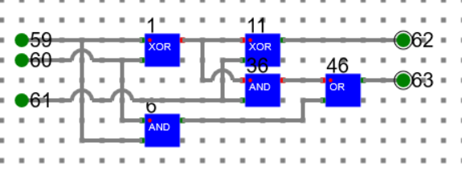
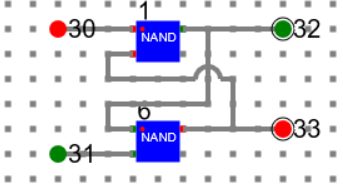
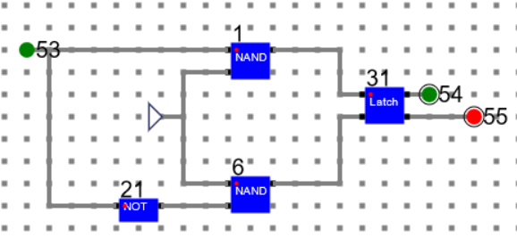
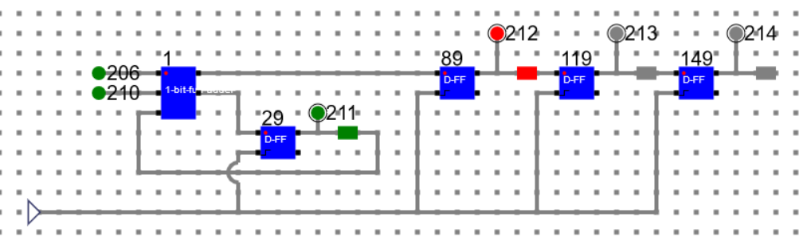
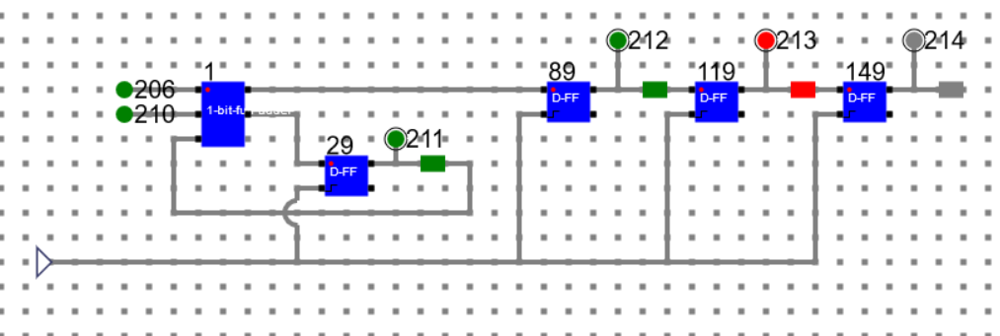
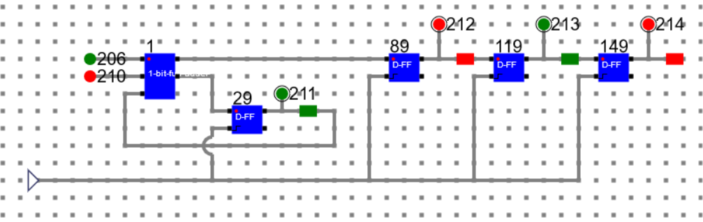
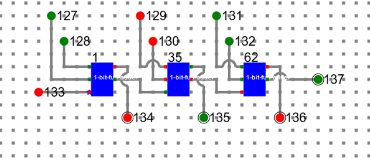

# Theory:

A serial adder is used to add two binary numbers in serial form. The two binary numbers to be added serially are stored in two shift registers. The circuit adds one pair at a time with the help of one full adder. The carry output from the full adder is applied to a D flip-flop, the output of which is then used as a carry input for the next pair of significant bits. However, the sum bit S from the output of the full adder can be transferred into a third shift register. 

A parallel adder is a combinational digital circuit that adds two binary numbers in parallel form. It consists of full adders connected in cascade, with the output carry from each full adder connected to the input carry of the next full adder.

## Circuit diagram for serial adder
First design a full adder as below and make a component. Here 59, 60 are input data bits. 61 is carry in bit. 62 is sum out and 63 is carry out.

Similarly design Latch circuit and make a component. 30 and 31 are input data bits. 32 and 33 are output data bits.

Using latch design a D-FF and make a component. Here 53 is input bit. 54 and 55 are output bits.

Using Full_Adder, and D-FF components, design sequential adder circuit and perform addition as described below.
Let experiment with adding two binary numbers: 111 and 011. As this is a sequential adder, the inputs will be given one by one from LSB to MSB and clock will be triggered. The final result will be stored in a shift register.

### Clock 1: 

Input Bits: 1[206], 1[210] and Carry In: 0[211]

Sum Out: 0[212] and Carry Out: 1[211]

### Clock 2:

Input Bits: 1[206], 1[210] and Carry In: 1[211]

Sum Out: 1[212], 0[213] and Carry Out: 1[211]

### Clock 3:

Input Bits: 1[206], 0[210] and Carry In: 1[211]

Sum Out: 0[212], 1[213], 0[214] and Carry Out: 1[211]

Final Sum: 010 and Carry: 1

## Circuit Diagram of a 3 bit Parallel Adder

For parallel adder, just use 1_Bit_Full_Adder as shown in the picture. We are experimenting with two binary numbers: 101 and 101. The result is 010 and carry 1.

Binary Number One: 1[127], 0[129], 1[131]

Binary Number Two: 1[128], 0[130], 1[132]

Carry In: 0[133]

Sum Out: 0[134], 1[135], 0[136]

Carry Out: 1[137]