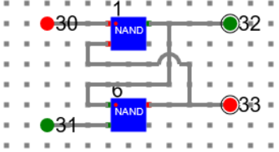

# Procedure

## Circuit diagram for serial adder
- First design a 1 bit full adder as below and make a component with name say ‘1-bit-fulladder’.

- Similarly design Latch circuit and make a component say ‘Latch’.

- Using latch design a D-FF and make a component. 

- Using 1-Bit_Full_Adder, and D-FF components design sequential adder circuit and perform addition as described below.

- Let experiment with adding two binary numbers: 111 and 011. As this is a sequential adder, the inputs will be given one by one from LSB to MSB and clock will be triggered. The final result will be stored in a shift register.

- Draw a circuit in the simulator as below.

1: 1 Bit Full Adder. 

29, 89,119,149: D Flip Flop

### Clock 1: 

Input Bits: 1[206], 1[210] and Carry In: 0[211]

Sum Out: 0[212] and Carry Out: 1[211]

### Clock 2:

Input Bits: 1[206], 1[210] and Carry In: 1[211]

Sum Out: 1[212], 0[213] and Carry Out: 1[211]

### Clock 3:

Input Bits: 1[206], 0[210] and Carry In: 1[211]

Sum Out: 0[212], 1[213], 0[214] and Carry Out: 1[211]

**Final Sum: 010 and Carry: 1**

## Circuit Diagram of a 3 bit Parallel Adder

For parallel adder, just use 1_Bit_Full_Adder (1, 35, 62) as shown in the picture. We are experimenting with two binary numbers: 101 and 101. The result is 010 and carry 1.

Binary Number One: 1[127], 0[129], 1[131]

Binary Number Two: 1[128], 0[130], 1[132]

Carry In: 0[133]

Sum Out: 0[134], 1[135], 0[136]

Carry Out: 1[137]

# Manual
- Follow the below manual and perform the experiment
    - Manual --> [Click Here](./simulation/coavlNew.pdf)

<embed src="./simulation/coavlNew.pdf" type="application/pdf">

